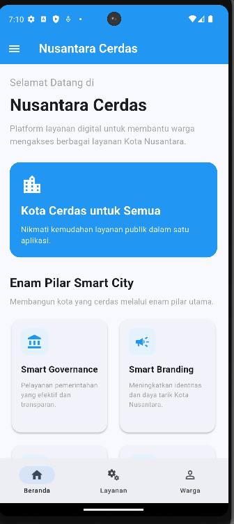
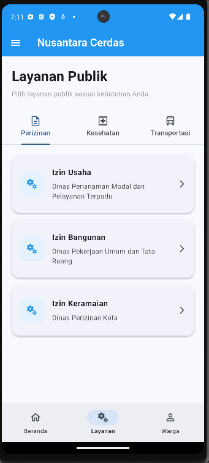
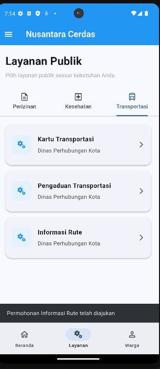
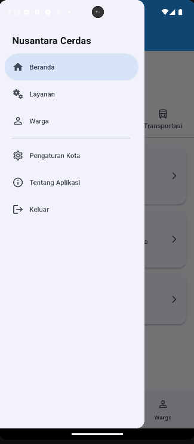
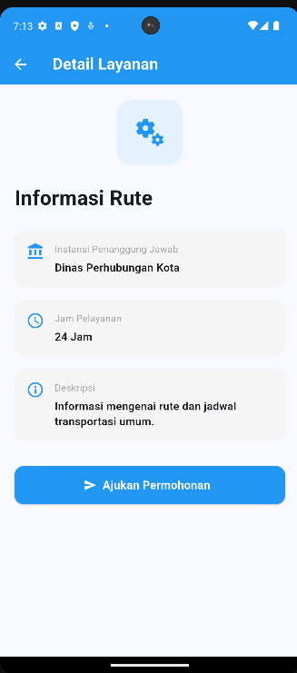
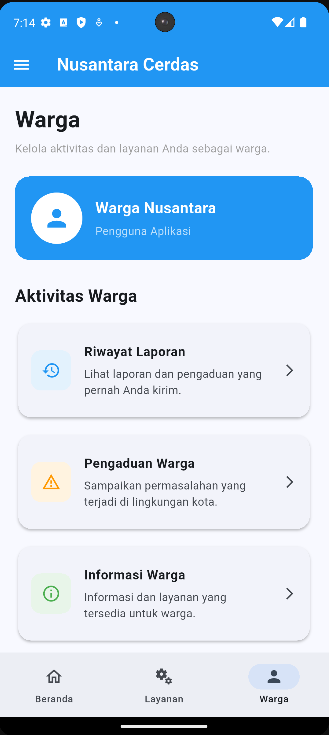
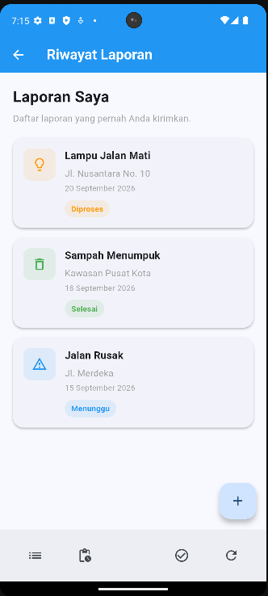
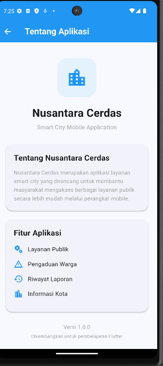
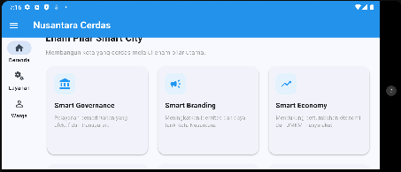

# Nusantara Cerdas Mobile

Purwarupa aplikasi layanan warga **Smart City** berbasis Flutter. Aplikasi ini dibuat untuk **Praktikum Modul II: Navigasi dan Routing pada Aplikasi Flutter** pada mata kuliah Pemrograman Perangkat Bergerak Lanjut.

Aplikasi membantu warga Kota Nusantara mengakses layanan publik dalam satu aplikasi, mulai dari perizinan, kesehatan, dan transportasi, hingga riwayat laporan warga. Fokus utamanya adalah penerapan **Navigator, named route, NavigationBar, NavigationDrawer, tab, BottomAppBar, dan NavigationRail** dalam satu kerangka navigasi yang menyesuaikan lebar layar.

## Identitas Pembuat

| | |
|---|---|
| Nama | M Hidayat Nur Wahid |
| NIM | 707012400013 |
| Kelas | D4 SIKC 48-05 |
| Program Studi | D4 Sistem Informasi Kota Cerdas |
| Mata Kuliah | Pemrograman Perangkat Bergerak Lanjut |

## Fitur

- **Beranda** berisi sambutan, kartu informasi, dan enam pilar Smart City (Smart Governance, Smart Branding, Smart Economy, Smart Living, Smart Society, Smart Environment) dalam grid yang berubah menjadi tiga kolom pada layar lebar.
- **Layanan Publik** dengan tiga tab: Perizinan, Kesehatan, dan Transportasi. Tiap tab memuat tiga layanan.
- **Detail Layanan** menampilkan instansi penanggung jawab, jam pelayanan, dan deskripsi. Tombol *Ajukan Permohonan* menutup halaman dan mengirim pesan balik yang ditampilkan sebagai SnackBar.
- **Warga** berisi kartu profil dan menu Riwayat Laporan, Pengaduan Warga, serta Informasi Warga.
- **Riwayat Laporan** menampilkan daftar laporan beserta status (Diproses, Selesai, Menunggu), dilengkapi `BottomAppBar` dan `FloatingActionButton`.
- **Navigation Drawer** memuat tiga tujuan utama serta menu Pengaturan Kota, Tentang Aplikasi, dan Keluar (dengan dialog konfirmasi).
- **Tampilan adaptif**: `NavigationBar` di bawah pada layar sempit dan `NavigationRail` di kiri pada lebar 600 piksel logis atau lebih.
- **Penanganan route tidak dikenal** melalui `onUnknownRoute`, sehingga alamat yang salah tidak membuat aplikasi berhenti.

## Tangkapan Layar

<table>
  <tr>
    <td align="center"><br><sub>Beranda</sub></td>
    <td align="center"><br><sub>Layanan (tab Perizinan)</sub></td>
    <td align="center"><br><sub>Layanan (tab Transportasi)</sub></td>
  </tr>
  <tr>
    <td align="center"><br><sub>Navigation Drawer</sub></td>
    <td align="center"><br><sub>Detail Layanan</sub></td>
    <td align="center"><br><sub>Warga</sub></td>
  </tr>
  <tr>
    <td align="center"><br><sub>Riwayat Laporan</sub></td>
    <td align="center"><br><sub>Tentang Aplikasi</sub></td>
    <td></td>
  </tr>
</table>

**Layar lebar (NavigationRail):**



## Teknologi

- Flutter 3.47.4 (channel stable)
- Dart 3.13.3
- Material 3 (`useMaterial3: true`) dengan warna dasar biru
- Tanpa paket tambahan; hanya memakai `package:flutter/material.dart`

## Struktur Proyek

```
lib/
├── main.dart
├── navigation/
│   ├── app_routes.dart
│   └── kerangka_navigasi.dart
└── pages/
    ├── beranda_page.dart
    ├── layanan_page.dart
    ├── detail_layanan_page.dart
    ├── warga_page.dart
    ├── riwayat_laporan_page.dart
    ├── pengaturan_kota_page.dart
    ├── tentang_aplikasi_page.dart
    └── route_tidak_dikenal_page.dart
```

## Daftar Route

| Route | Halaman | Keterangan |
|---|---|---|
| `/` | `KerangkaNavigasi` | Kerangka utama (Beranda, Layanan, Warga) |
| `/layanan` | `LayananPage` | Layanan publik dengan tiga tab |
| `/detail-layanan` | `DetailLayananPage` | Dibentuk lewat `onGenerateRoute` karena membawa argumen |
| `/warga` | `WargaPage` | Aktivitas warga |
| `/riwayat-laporan` | `RiwayatLaporanPage` | Daftar laporan warga |
| `/pengaturan-kota` | `PengaturanKotaPage` | Pilihan kota, notifikasi, dan lokasi |
| `/tentang-aplikasi` | `TentangAplikasiPage` | Informasi aplikasi dan versi |
| route lain | `RouteTidakDikenalPage` | Ditangani `onUnknownRoute` |

## Alur Navigasi

| Perpindahan | Mekanisme | Tumpukan route |
|---|---|---|
| Beranda ↔ Layanan ↔ Warga | NavigationBar / NavigationRail / Drawer (`setState`) | Tidak bertambah |
| Tab Perizinan / Kesehatan / Transportasi | `TabBar` + `TabBarView` | Tidak bertambah |
| Layanan → Detail Layanan | `Navigator.pushNamed` | Bertambah |
| Detail Layanan → Layanan (+ pesan) | `Navigator.pop(context, nilai)` | Berkurang |
| Warga → Riwayat Laporan | `Navigator.pushNamed` | Bertambah |
| Drawer → Pengaturan Kota / Tentang Aplikasi | `pop` drawer, lalu `pushNamed` | Bertambah |
| Route tidak dikenal → Beranda | `pushNamedAndRemoveUntil` | Dikosongkan |

## Cara Menjalankan

Prasyarat: Flutter SDK sudah terpasang dan `flutter doctor` tidak menampilkan masalah pada komponen yang dipakai.

```bash
# 1. Unduh repositori
git clone <URL-repositori>
cd nusantara_cerdas_nav_707012400013

# 2. Pasang dependensi
flutter pub get

# 3. Jalankan di emulator Android atau perangkat terhubung
flutter run

# 4. Jalankan di Chrome untuk menguji layar lebar
flutter run -d chrome
```

Untuk menguji tampilan adaptif, lebarkan jendela Chrome hingga lebih dari 600 piksel atau putar emulator ke posisi lanskap, sehingga `NavigationBar` berganti menjadi `NavigationRail`.

## Catatan Pengembangan

- Halaman Beranda, Layanan, dan Warga tidak memiliki `Scaffold` sendiri karena tampil di dalam `Scaffold` milik kerangka navigasi, sehingga tidak muncul dua AppBar.
- Pada Riwayat Laporan, `FloatingActionButton` berada di posisi bawaan (kanan bawah). Agar cekungan `BottomAppBar` terbentuk, tambahkan `floatingActionButtonLocation: FloatingActionButtonLocation.centerDocked` pada `Scaffold`.
- Drawer belum memakai `selectedIndex`, sehingga item yang tersorot belum mengikuti tujuan yang sedang aktif.

## Lisensi

Proyek ini dibuat untuk keperluan pembelajaran pada praktikum Pemrograman Perangkat Bergerak Lanjut.
